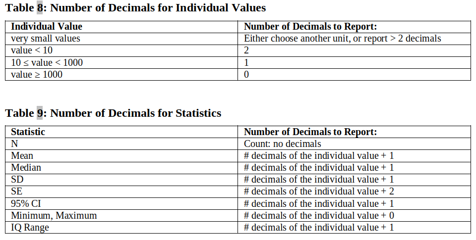

```{r options, echo = FALSE}
	
	library(knitr)
	opts_chunk$set(
		echo = TRUE, results = 'markup', warning = FALSE, 
		# stop document execution if error (not the default)
		error = FALSE, 
		message = FALSE, cache = FALSE,
		fig.width = 8, fig.height = 7,
		fig.path = "./figures_vignette/",
		fig.align = 'center')
	options(width = 170)
	# instead of warn = 0 by default
	# include warnings when they occur in the document
	options(warn = 1)
	
```


This vignette focuses on how to create in-text tables with the
`inTextSummaryTable` package.

In this vignette we assume you have ready the `data.frame`(s) to create the
tables. If you have doubts on the data format, please look the introductory
vignette at the section "data format".

We will use the example data available in the `clinUtils` package. Let's load
the packages and the data, and get started!


```{r loadPackages}

	library(inTextSummaryTable)
	library(pander)
	library(tools) # toTitleCase

```

```{r loadData}	
	
	library(clinUtils)

	# load example data
    data(dataADaMCDISCP01)
	
	dataAll <- dataADaMCDISCP01
    labelVars <- attr(dataAll, "labelVars")
	
```


The **`getSummaryStatisticsTable`** creates an in-text table of summary
statistics for variable(s) of interest.

The _Demographic_ data (`ADSL` dataset) is used as example for the summary
statistics table.

```{r data-SL}

	dataSL <- dataAll$ADSL

```

# Variable(s) to summarize

Variable(s) to summarize in the table are specified via the **`var` parameter**.

Different set of statistics are reported depending on the type of variable:
[Categorical variable] or [Continuous variable].

See the documentation in section _Base statistics_ for more details on the
statistics included by default for each type, via:

```{r getHelp, eval = FALSE}

? `inTextSummaryTable-stats` 

```

## Categorical variable

For a **discrete/categorical variable**, the in-text table can display the
**counts/percentages of the number of subjects or records for each category** of
the variable.

### Counts of the entire dataset

If **no variable is specified** (via the `var` parameter), the counts are
displayed for the **entire dataset**.

```{r count-simple}

	getSummaryStatisticsTable(data = dataSL)

```

Please note that this is equivalent of setting (`var = 'all'`).

### Counts of categories

If a **variable is specified** (via the `var` parameter), the counts are
displayed **for each category**.

```{r count-categories}

	getSummaryStatisticsTable(data = dataSL, var = "SEX")

```

### Sort categories

The categories of the variable are sorted alphabetically by default. To sort the
categories in a specific order, the variable should be formatted as
**`factor`**, whose ordered categories are included in its **`levels`**.

```{r count-categories-order}

	# specify manually the order of the categories
	dataSL$SEX <- factor(dataSL$SEX, levels = c("M", "F"))
	getSummaryStatisticsTable(data = dataSL, var = "SEX")
	
	# order categories based on a numeric variable
    dataSL$SEXN <- ifelse(dataSL$SEX == "M", 2, 1)
	dataSL$SEX <- reorder(dataSL$SEX, dataSL$SEXN)
	getSummaryStatisticsTable(data = dataSL, var = "SEX")
	
```

### Inclusion of categories not available in the data

By default, the table only includes the categories present in the input data, to
ensure a compact table for CSR export.

```{r count-categories-empty-1}

	dataSLExample <- dataSL
	
	# 'SEX' formatted as character with only male
	dataSLExample$SEX <- "M" # only male
	getSummaryStatisticsTable(data = dataSLExample, var = "SEX")
	
```	

If extra categories should be represented in the table, the categorical variable
should be **formatted as a factor**, whose **levels contain all categories** to
be displayed in the table.

Furthermore, the parameter: `varInclude0` should be set to `TRUE` or to the
specific variable (in case multiple variables are specified) to indicate that
categories with 0 counts should be included.

```{r count-categories-empty-2}
	
	# 'SEX' formatted as factor, to include also female in the table
	# (even if not available in the data)
	dataSLExample$SEX <- factor("M", levels = c("F", "M"))
	getSummaryStatisticsTable(data = dataSLExample, var = "SEX", varInclude0 = TRUE)
	# or:
    getSummaryStatisticsTable(data = dataSLExample, var = "SEX", varInclude0 = "SEX")

```


### Count table for 'flag'-variables

A specific type of categorical variable is a **'flag variable'**, which indicates
if a record fulfills a specific criteria.

Such variable is typically formatted in the data as: 

* 'Y' if the criteria is met for the specific record
* 'N' if the criteria is not fulfilled for the specific record
* '' if the criteria is missing for this record

The name of such variable typically ends with **'FL'** in a CDISC-compliant _ADaM_
or _SDTM_ dataset.

For example, the subject-level dataset contains the following flag variables:

```{r flag-variables}

    labelVars[grep("FL$", colnames(dataSL), value = TRUE)]
    # has the subject discontinued from the study?
    dataSL$DISCONFL

```

If this variable is specified in `var`, the counts for each category is
reported:

```{r count-flag-var}

    getSummaryStatisticsTable(
	    data = dataSL,
	    var = "SAFFL"
    )

```

However, the interest is often to only reports the counts for the records
fulfilling the criteria (records with 'Y'). This is the case if the variable is
specified via the `varFlag` parameter too.

```{r count-flag-varFlag}

	getSummaryStatisticsTable(
		data = dataSL,
		var = "SAFFL",
		varFlag = "SAFFL"
	)

```

### Inclusion of total across categories

To include the total counts across categories, the `varTotalInclude` parameter
should be set to `TRUE` (or to the specific variable).

```{r count-varTotalInclude}

	getSummaryStatisticsTable(
		data = dataSL, 
		var = "SEX", 
		varTotalInclude = TRUE
	)

```

## Continuous variable

For a **continuous variable**, the in-text table displays **standard
distribution statistics** of the variable.
  
Please note that **missing records (NA) for the variable are filtered**, so the
**count statistics** (number of subjects, records, percentage) are based **only
on the non missing records**.
  
For a continuous variable, the presence of different values for the same subject 
(and across row/column variables) are checked and an appropriate error message
is returned if multiple different values are available.

```{r numeric}

	getSummaryStatisticsTable(data = dataSL, var = "AGE")

```

## Continuous and categorical variables in the table

The table can contain a mix of categorical and continuous variables.

```{r mixedTable}

	getSummaryStatisticsTable(
		data = dataSL, 
		var = c("AGE", "SEX")
	)

```

# Statistics of interest

Statistics of interest and their format are specified via the **`stats`
parameter**.

If an unique statistic expression is specified, the 'Statistic' column doesn't
appear in the table.  
In case multiple statistics are specified, these are
included as separated row.

## Standard statistic set

A standard set of statistics is specified via specific tags to be passed to the
`stats` function.

The list of available statistics is mentioned in the section '_Formatted
statistics_' in:

```{r getHelpStats, eval = FALSE}

    ? `inTextSummaryTable-stats` 

```

Please see below examples of commonly used statistics.

### Categorical table

```{r stats-count}

	# count: n, '%' and m
	getSummaryStatisticsTable(
		data = dataSL,
		var = "SEX",
		stats = "count"
	)

	# n (%)
	getSummaryStatisticsTable(
		data = dataSL,
		var = "SEX",
		stats = "n (%)"
	)
	
	# n/N (%)
	getSummaryStatisticsTable(
		data = dataSL,
		var = "SEX",
		stats = "n/N (%)"
	)
	
```

### Continuous variable

```{r stats-numeric}
	
	## continuous variable
	
	# all summary stats
	getSummaryStatisticsTable(
		data = dataSL,
		var = "AGE",
		stats = "summary"
	)
	
	# median (range)
	getSummaryStatisticsTable(
		data = dataSL,
		var = "AGE",
		stats = "median (range)"
	)
	
	# median and (range) in a different line:
	getSummaryStatisticsTable(
		data = dataSL,
		var = "AGE",
		stats = "median\n(range)"
	)
	
	# mean (se)
	getSummaryStatisticsTable(
		data = dataSL,
		var = "AGE",
		stats = "mean (se)"
	)
	
	# mean (sd)
	getSummaryStatisticsTable(
		data = dataSL,
		var = "AGE",
		stats = "mean (sd)"
	)

```

## Custom statistics formatting (Advanced)

To change the formatting of the statistics, the `stats` parameter should contain
a language object (e.g. `expression` or `call`) of the default base set of
statistics.

See the documentation in section '_Base statistics_' for more details on the base
statistics included by default, via:

```{r getHelpStats2, eval = FALSE}

? `inTextSummaryTable-stats` 

```

For example, the following count table is restricted to the number of subjects
per categories:

```{r stats-N}

	getSummaryStatisticsTable(
		data = dataSL,
		var = c("RACE", "SEX"),
		stats = list(N = expression(statN))
	)

```

The summary statistics table is restricted to the median and range:

```{r stats-meanSE}

	getSummaryStatisticsTable(
		data = dataSL,
		var = c("AGE", "HEIGHTBL", "WEIGHTBL", "BMIBL"),
		varGeneralLab = "Parameter", statsGeneralLab = "",
		colVar = "TRT01P",
		stats = list(
			`median` = expression(statMedian),
			`(min, max)` = expression(paste0("(", statMin, ",", statMax, ")"))
		)
	)

```

Note that the 'Standard statistics set' is formatted internally via the
`getStatsData` (and `getStats`) functions, which creates consistently a list of
`language` objects.

```{r getStatsData}

    # this count table:
    getSummaryStatisticsTable(
	    data = dataSL,
	    var = "SEX",
	    stats = "count"
    )
    # ... is equivalent to:
    getSummaryStatisticsTable(
	    data = dataSL,
	    var = "SEX",
	    stats = getStats(type = "count")
    )

    # this summary table...
    getSummaryStatisticsTable(
	    data = dataSL,
	    var = "AGE",
	    stats = "mean (se)"
    )
    # ... is equivalent to:
    getSummaryStatisticsTable(
	    data = dataSL,
	    var = "AGE",
	    stats = getStatsData(type = "mean (se)", var = "AGE", data = dataSL)[["AGE"]]
    )
```

## Statistics by variable/group

The statistics can also be provided for each variable separately, if `stats` is
named by variable:

```{r statExtra-EachVariable}
		
	getSummaryStatisticsTable(
		data = dataSL, 
		var = c("AGE", "RACE"),
		stats = list(
			AGE = getStats("median (range)"),
			RACE = getStats("n (%)")
		)
	)

```

## Extra statistics

Extra statistics (not available in the default set of statistics) should be
specified via the `statsExtra` parameter.

A set of extra utility functions to compute common extra statistics are also
available in the package:

* coefficient of variation with the `cv` function
* geometric mean with the `geomMean` function
* geometric standard deviation with the `geomSD` function
* geometric coefficient of variation with the `geomCV` function

```{r statsUtilityFct}

	getSummaryStatisticsTable(
		data = dataSL,
		var = "HEIGHTBL",
		# specify extra stats to compute
		statsExtra = list(
			statCV = cv,
			statGeomMean = geomMean,
			statGeomSD = geomSD,
			statsGeomCV = geomCV
		)
	)

```

Full customized statistics can also be provided. For example, if you would like
to specify your own formula for the coefficient of variation:

```{r statsExtra}

	# include the coefficient of variation via the 'statsExtra' parameter
	getSummaryStatisticsTable(
		data = dataSL,
		var = "HEIGHTBL",
		statsExtra = list(statCVPerc = function(x) sd(x)/mean(x)*100)
	)

```

These statistics are then available for customization via the `stats` parameter.

```{r statsExtra-stats}

	# format the statistics with the 'stats' parameter
	getSummaryStatisticsTable(
		data = dataSL,
		var = "HEIGHTBL",
		statsExtra = list(statCVPerc = function(x) sd(x)/mean(x)*100),
		stats = list(Mean = expression(statMean), 'CV%' = expression(statCVPerc))
	)


```

## Rounding strategy

Please note that all statistics are rounded by default 
in the package based on the 
**'rounding up' strategy for rounding off a 5**, 
which **differs from the default rounding strategy in R** (`round` function).

This was a deliberate choice to reproduce summarized statistics 
created with the SAS software.

Please find more explanations in the documentation of the 
`? roundHalfUp` and `? roundHalfUpTextFormat` functions.

## Number of decimals

The detailed rules for the number of decimals for the statistics
are described in the section _Statistics formatting_ in:

```{r getHelpStats3, eval = FALSE}

    ? `inTextSummaryTable-stats` 

```

To specify fixed amounts of digits for the statistics to be displayed in the
table, the statistics are formatted in the `stats` parameter.

### Default number of decimals

#### Categorical variable

The percentages are formatted by default as specified in the table below.

```{r nDecimals-catVar, echo = FALSE, fig.cap = "Standard Layout for Frequency Tabulations of Categorical Variables<br>"}

include_graphics("./images/nDecimals_catVar.png")

```

By default, the counts for a categorical variables are formatted as specified
above:

* the number of subjects is displayed with 0 digits (`nDecN` is set to 0)
* the frequency percentage is implemented in the `formatPercentage` function

```{r getStats-count}

	# Internal rule for the number of decimals for the percentage
	formatPercentage(c(NA, 0, 100, 99.95, 0.012, 34.768))
	
	# Used by default in the 'getStats' function
	getStats(type = "count")

```

#### Continuous variable {#numberDecimalsContinuousVariable}

The number of decimals for statistics based on a continuous variable is by default
as specified in the tables below.

```{r nDecimals-numVar, echo = FALSE, fig.cap = "Standard Layout for Descriptive Statistics of Continuous Variables<br>"}



```

In the package: 'Very small values' are considered values below 1.

When specifying the default set of available statistics with the `getStats`
function, and **only if the variable is specified** (`x` parameter), the number
of decimals for a continuous variable is determined by:

1. Extracting the number of decimals for individual values based on:
    + **pre-defined rules** based on the number of decimals of the individual
      values (`getNDecimalsRule` function)
    + the number of decimals **available in the input data** via the
      `getNDecimalsData` function
    + taking the **minimum of these two criterias** (`getNDecimals` function), 
    such as the number of decimals according  the rule won't be higher that the
      actual number of decimals available in the data
2. Taking the **maximum number of decimals** across all individual values via
   the `getMaxNDecimals` function, which is used as 'base' number of decimals
   considered for the summary statistics
3. The actual number of decimals for each statistic is extracted 
by adding to the 'base' number of decimals:
    + **0 extra decimal for the minimum, maximum**
    + **1 extra decimal for the mean, median, sd**
    + **2 extra decimals for SE**

Please note that if a different framework than implemented in steps 1 and 2
should be used for the extraction of the number of decimals for a specific
variable, the number of decimals of interest can be fixed via the `nDecCont`
parameter.

```{r getMaxNDecimals}

	# Duration of Disease (Months)
	print(dataSL$DURDIS)
	
	## Extract the number of decimals for each value:
	
	# based on pre-defined rule, this metric should be displayed with 1 decimal:
	getNDecimalsRule(x = dataSL$DURDIS)
	
	# but available in the data only with 0 decimals
	getNDecimalsData(x = dataSL$DURDIS)
	
	# The minimum of the #decimals based on the data and pre-defined rule is:
	getNDecimals(x = dataSL$DURDIS)
	
	## Take the maximum number of decimals 
	getMaxNDecimals(x = dataSL$DURDIS)
	
	## Custom set of statistics are extracted when x is specified:
	getStats(x = dataSL$DURDIS)
	
	# To fix the number of decimals:
	getStats(type = "summary", nDecCont = 1)
	
	## Create summary statistics table
	getSummaryStatisticsTable(
		data = dataSL,
		var = c("AGE", "DURDIS"),
		stats = list(
			AGE = getStats(type = "median (range)", x = dataSL$AGE),
            DURDIS = getStats(type = "median (range)", x = dataSL$DURDIS)
		)
	)

```

### Custom `stats` function (Advanced)

A  custom function can be created to create custom statistics with fixed number
of digits.

For example, the AGE is displayed with 1 digit and the height with two digits:

```{r stats-digits}

	getSummaryStatisticsTable(
		data = dataSL,
		var = c("AGE", "HEIGHTBL"),
		stats = list(
			AGE = list(Median = expression(roundHalfUpTextFormat(statMedian, 1))),
            HEIGHTBL = list(Median = expression(roundHalfUpTextFormat(statMedian, 2)))
		)
	)

```

To create the `stats` parameter for a specific number of digits, a custom
function can be created:

```{r stats-digits-complex}

	# wrapper function to include median with specific number of digits
	# and min/max with specified number of digits - 1
	statsDMNum <- function(digitsMin)
		list('Median (range)' = 
			bquote(paste0(
				roundHalfUpTextFormat(statMedian, .(digitsMin+1)), 
				" (", roundHalfUpTextFormat(statMin, .(digitsMin)), ",", 
				roundHalfUpTextFormat(statMax, .(digitsMin)),
				")"
			))
	)

	getSummaryStatisticsTable(
		data = dataSL,
		var = c("AGE", "HEIGHTBL", "WEIGHTBL", "BMIBL", "RACE", "SEX"),
		stats = list(
			AGE = statsDMNum(0),
			HEIGHTBL = statsDMNum(1),
			WEIGHTBL = statsDMNum(1),
			BMIBL = statsDMNum(1),
			RACE = getStats("n (%)"),
			SEX = getStats("n (%)")
		)
	)

```

## Statistics layout

The layout of the statistics is specified via the `statsLayout` parameter.  

By default, the statistics are included in rows within each variable.

```{r statsLayoutRow}

	# statsLayout = 'row'
	getSummaryStatisticsTable(
		data = dataSL,
		var = c("AGE", "HEIGHTBL"),
		stats = list(Mean = expression(statMean), 'SE' = expression(statSE))
	)
	
```

The statistics can also be included in columns.

```{r statsLayoutCol}

	getSummaryStatisticsTable(
		data = dataSL,
		var = c("AGE", "HEIGHTBL"),
		stats = list(Mean = expression(statMean), 'SE' = expression(statSE)),
		statsLayout = "col"
	)

```

The statistics can also be specified in different rows, but in a separated
column.

```{r summaryTable-PP-medianMinMax-statsLayoutRowVarInSepCol}

	getSummaryStatisticsTable(
		data = dataSL,
		var = c("AGE", "HEIGHTBL"),
		stats = list(Mean = expression(statMean), 'SE' = expression(statSE)),
		statsLayout = "rowInSepCol"
	)

```

By default, if only one statistic is available in the table, the name of the
statistic is not included in the rows/columns, as the statistic is generally
described in this case in the title of the table.

```{r summaryTable-statsLayout-onlyOneStat}

	getSummaryStatisticsTable(
		data = dataSL,
		var = c("AGE", "HEIGHTBL"),
		stats = list(Mean = expression(statMean))
	)

```

To include even in this case the name of the statistic, the parameter
`statsLabInclude` should be set to `TRUE`.

```{r summaryTable-statsLayout-onlyOneStat-statsLabInclude}

	getSummaryStatisticsTable(
		data = dataSL,
		var = c("AGE", "HEIGHTBL"),
		stats = list(Mean = expression(statMean)),
		statsLabInclude = TRUE
	)

```

# Table layout

The general table layout is driven by the specification of variables to be
displayed in rows (in the vertical direction) or in columns (in the horizontal
direction).

If no variables are specified in `var`, counts across row/column variable are
displayed.

The adverse events dataset is used for demonstration.

```{r countTable-AE-data}
				
	dataAE <-  subset(dataAll$ADAE, SAFFL == "Y" & TRTEMFL == "Y")
	
	# ensure that order of elements is the one specified in 
	# the corresponding numeric variable
	dataAE$TRTA <- with(dataAE, reorder(TRTA, TRTAN))
	dataAE$AESEV <- factor(
		dataAE$AESEV, 
		levels = c("MILD", "MODERATE", "SEVERE")
	)
	
	dataAEInterest <- subset(dataAE, AESOC %in% c(
		"INFECTIONS AND INFESTATIONS",
        "GENERAL DISORDERS AND ADMINISTRATION SITE CONDITIONS"
       )
    )

```

## Row and column variables

Specific grouping variable(s) for the columns can be specified via the
**`colVar`** parameter and for the rows via the **`rowVar`** parameter.

If multiple category variables are specified, they should be specified in
hierarchical order.

```{r rowVarColVar}

	# unique row variable
	getSummaryStatisticsTable(
		data = dataAEInterest,
		rowVar = "AEDECOD",
		stats = getStats("n (%)"),
		labelVars = labelVars
	)
	
	# multiple nested row variables
	getSummaryStatisticsTable(
		data = dataAEInterest,
		rowVar = c("AESOC", "AEDECOD"),
		stats = getStats("n (%)"),
		labelVars = labelVars
	)
	
	# unique column variable
	getSummaryStatisticsTable(
		data = dataAEInterest,
		colVar = "TRTA",
		stats = getStats("n (%)"),
		labelVars = labelVars
	)
	
	# combination of rows and columns
	getSummaryStatisticsTable(
		data = dataAEInterest,
		rowVar = c("AESOC", "AEDECOD"),
		colVar = "TRTA",
		stats = getStats("n (%)"),
		labelVars = labelVars,
		colHeaderTotalInclude = FALSE
	)

```

## Row variable

By default (when `outputType` is set to: 'flextable'), if multiple row variables
are specified, they are considered nested and displayed in the first column of
the final table. Each sub-category is indicated with a specific indent
(customizable with `rowVarPadBase`).

### Variable in separated column

**Row variables** that should be included as a **separated column** should be
specified via the `rowVarInSepCol` parameter.

```{r rowVarInSepCol}

	getSummaryStatisticsTable(
		data = dataAEInterest,
		rowVar = c("AESOC", "AEDECOD", "AESEV"),
		rowVarInSepCol = "AESEV",
		colVar = "TRTA",
		stats = getStats("n (%)"),
		labelVars = labelVars
	)
	
```

### Row ordering

The **categories in the row variables can be ordered** based on the
**`rowOrder`** variable. 

This variable is either:

* a string with the name of an implemented method to order the rows, among:
     + `alphabetical`: categories are ordered **alphabetically**
     + `auto`: categories are ordered based on the **levels** if the input
       variable is a factor,    alphabetically otherwise
     + `total`: categories are ordered based on the 'total' column (see section
       \@ref(colTotal))    (if the total column is not included in the table)
* a custom ordering function to apply in the data to order the rows

#### Common order for all row variables

```{r rowOrder-common}

	# 'auto':

	# set order of SOC to reverse alphabetical order
	dataAEInterest$AESOC <- factor(
		dataAEInterest$AESOC, 
		levels = rev(sort(unique(as.character(dataAEInterest$AESOC))))
	)
	# AEDECOD is not a factor -> sort alphabetically by default
	getSummaryStatisticsTable(
		data = dataAEInterest,
		rowVar = c("AESOC", "AEDECOD"),
		rowVarLab = labelVars[c("AEDECOD")],
		rowVarTotalInclude = c("AESOC", "AEDECOD"),
		colVar = "TRTA", colTotalInclude = TRUE,
		stats = getStats("n (%)"),
		labelVars = labelVars
	)
	
	# total counts
	getSummaryStatisticsTable(
		data = dataAEInterest,
		rowVar = c("AESOC", "AEDECOD"),
		rowVarLab = labelVars[c("AEDECOD")],
		rowVarTotalInclude = c("AESOC", "AEDECOD"),
		colVar = "TRTA", colTotalInclude = TRUE, colTotalLab = "Number of subjects",
		rowOrder = "total",
		stats = getStats("n (%)"),
		labelVars = labelVars
	)
	# same order even if the 'total' column is not specified
	getSummaryStatisticsTable(
		data = dataAEInterest,
		rowVar = c("AESOC", "AEDECOD"),
		rowVarLab = labelVars[c("AEDECOD")],
		rowVarTotalInclude = c("AESOC", "AEDECOD"),
		colVar = "TRTA", 
		rowOrder = "total", 
		stats = getStats("n (%)"),
		labelVars = labelVars
	)

```

#### Different orders for each row variable

In case the order should be different for each row variable, a named list is
provided for the `rowVar` parameter.

```{r rowOrder-specific}

	getSummaryStatisticsTable(
		data = dataAEInterest,
		rowVar = c("AESOC", "AEDECOD"),
		rowVarLab = labelVars[c("AEDECOD")],
		rowVarTotalInclude = c("AESOC", "AEDECOD"),
		colVar = "TRTA", #colTotalInclude = TRUE,
		rowOrder = c(AESOC = "alphabetical", AEDECOD = "total"),
		stats = getStats("n (%)"),
		labelVars = labelVars
	)

```

#### Row order based on the total of a column category

If the row categories should be **ordered by total counts for a specific
category of the column variable(s)**, a function **`rowOrderTotalFilterFct`** is
specified.

The adverse events are sorted based on the incidence in the treated group.

```{r rowOrder-rowOrderTotalFilterFct}

	getSummaryStatisticsTable(
		data = dataAEInterest,
		rowVar = c("AESOC", "AEDECOD"),
		rowVarLab = labelVars[c("AEDECOD")],
		rowVarTotalInclude = c("AESOC", "AEDECOD"),
		colVar = "TRTA", colTotalInclude = TRUE,
		rowOrder = "total",
		stats = getStats("n (%)"),
		labelVars = labelVars,
		# consider only the counts of the treated patients to order the rows
		rowOrderTotalFilterFct = function(x) subset(x, TRTA == "Xanomeline High Dose")
	)

```

#### Row order based on a custom specified function

If the method to order the rows is more complex, the `rowOrder` parameter
specifies a function taking the summary table as input and returning the order
levels of the elements in the row variable.

For example, the adverse event table is sorted based on the counts of patient
presenting this event across all treatment classes, and in case of ties based on 
the counts of treated-patients presenting this event.

```{r rowOrder-functionExample1}

	library(plyr)
	getSummaryStatisticsTable(
		data = dataAEInterest,
		type = "count",
		rowVar = "AEHLT",
		rowOrder = function(x){
			x <- subset(x, !isTotal)
			totalAcrossTreatments <- subset(x, TRTA == "Total")
			# counts across treated patients
			totalForTreatmentOnly <- subset(x, TRTA == "Xanomeline High Dose")
			dataCounts <- merge(totalAcrossTreatments, totalForTreatmentOnly, by = "AEHLT", suffixes = c(".all", ".treat"))
			# sort first based on overall count, then counts of treated patients
			dataCounts[with(dataCounts, order(`statN.all`, `statN.treat`, decreasing = TRUE)), "AEHLT"]
		},
		colVar = "TRTA", colTotalInclude = TRUE,
		labelVars = labelVars,
		title = "Table: Adverse Events ordered based on total counts",
		stats = list(expression(paste0(statN, " (", round(statPercN, 1), ")"))),
		footer = "Statistics: n (%)"
	)

```

The adverse event table is now ordered based on the counts in the placebo, then
treated-patients column, for the organ class and the adverse event term
separately.

```{r rowOrder-functionExample2}

	getSummaryStatisticsTable(
		data = dataAEInterest,
		rowVar = c("AESOC", "AEDECOD"),
		rowVarLab = labelVars[c("AEDECOD")],
		rowVarTotalInclude = c("AESOC", "AEDECOD"),
		colVar = "TRTA", colTotalInclude = TRUE,
		rowOrder = list(
			AESOC = function(table) {
				# records with total for each AESOC
				nAESOCPlacebo <- subset(table, !isTotal & grepl("placebo", TRTA) & AEDECOD == "Total")
				nAESOCTreat <- subset(table, !isTotal & grepl("High Dose", TRTA) & AEDECOD == "Total")
				nAESOCDf <- merge(nAESOCPlacebo, nAESOCTreat, by = "AESOC", suffixes = c(".placebo", ".treatment"))
				nAESOCDf[with(nAESOCDf, order(`statN.placebo`, `statN.treatment`, decreasing = TRUE)), "AESOC"]
			},
			AEDECOD = function(table) {
				# records with counts for each AEDECOD
				nAEDECODPlacebo <- subset(table, !isTotal & grepl("placebo", TRTA) & AEDECOD != "Total")
				nAEDECODTreat <- subset(table, !isTotal & grepl("High Dose", TRTA) & AEDECOD != "Total")
				nAEDECODDf <- merge(nAEDECODPlacebo, nAEDECODTreat, by = "AEDECOD", suffixes = c(".placebo", ".treatment"))
				nAEDECODDf[with(nAEDECODDf, order(`statN.placebo`, `statN.treatment`, decreasing = TRUE)), "AEDECOD"]
			}
		),
		stats = getStats("n (%)"),
		labelVars = labelVars
	)

```

### Row variable labels

#### Based on dataset

The **labels used for the variables parameter** (row variables) **are
automatically extracted from the labels** contained in the _SAS_ dataset, by
specifying the `labelVars` parameter.

```{r summaryTable-PP-rowVarWithLabel-labelVars}

	# combination of rows and columns
	getSummaryStatisticsTable(
		data = dataAEInterest,
		rowVar = c("AESOC", "AEDECOD"),
		colVar = "TRTA",
		stats = getStats("n (%)"),
		labelVars = labelVars
	)
	
```

#### Custom

The label can also be specified directly via the `rowVarLab` parameter, for each
variable in `rowVar`.

If an unique row label should be used (even if multiple row variables are
specified), `rowVarLab` is set to this unique label.

```{r summaryTable-PP-rowVarWithLabel-rowVarLab}

	getSummaryStatisticsTable(
		data = dataAEInterest,
		rowVar = c("AESOC", "AEDECOD"),
		colVar = "TRTA",
		stats = getStats("n (%)"),
		rowVarLab = c(
			'AESOC' = "TEAE by SOC and Preferred Term\nn (%)"
		),
		labelVars = labelVars
	)
	
```

### Inclusion of row/column categories not available in the data

As for the variable to summarize, to include categories in the row or column
variables not available in the data, these variables should be formatted as a
factor with categories specified in its levels.

Furthermore, the parameters `rowInclude0` and `colInclude0` should be set to
TRUE to include counts for empty categories within the row/column. 

```{r countTable-emptyVars}

	## only consider a subset of adverse events
	dataAESubset <- subset(dataAE, AEHLT == "HLT_0617")
	
	## create dummy categories for:
	# treatment
	dataAESubset$TRTA <- with(dataAESubset, 
		factor(TRTA, levels = c(unique(as.character(TRTA)), "Treatment B"))
	)
	# low-level term category
	dataAESubset$AELLT <- with(dataAESubset, 
		factor(AELLT, levels = c(unique(as.character(AELLT)), "Lymphocyte percentage increased"))
	)
	
	# create summary statistics table
	getSummaryStatisticsTable(
		data = dataAESubset,
		type = "count",
		rowVar = c("AEHLT", "AELLT"),
		rowInclude0 = TRUE, colInclude0 = TRUE,
		colVar = "TRTA",
		labelVars = labelVars,
		title = "Table: Adverse Events: white blood cell analyses",
		stats = getStats("n (%)"),
		footer = "Statistics: n (%)"
	)

```


## Variable(s) to summarize

### Default

The **variable(s) used for the summary statistics** (`var`) are included **by
default in rows**.

```{r summaryTable-layout-var}

    dataDIABP <- subset(dataAll$ADVS, 
		SAFFL == "Y" & ANL01FL == "Y" &
		PARAMCD == "DIABP" & 
		AVISIT %in% c("Baseline", "Week 8") &
		ATPT == "AFTER LYING DOWN FOR 5 MINUTES"
	)
    dataDIABP$TRTA <- reorder(dataDIABP$TRTA, dataDIABP$TRTAN)
    dataDIABP$AVISIT <- reorder(dataDIABP$AVISIT, dataDIABP$AVISITN)
    
	getSummaryStatisticsTable(
		data = dataDIABP,
		var = c("AVAL", "CHG"),
		colVar = "TRTA",
		rowVar = "AVISIT",
		labelVars = labelVars,
		stats = getStats("summary-default")
	)

```

### Summary variable in columns

In case multiple variables are to be summarized, the different variables can be
included in different columns by including the specific label: 'variable' in
`colVar`. Beware that such layout only makes sense for variables with similar
types (e.g. all numeric variables).

```{r summaryTable-layout-varInColumn}
    
getSummaryStatisticsTable(
	data = dataDIABP,
	var = c("AVAL", "CHG"),
	colVar = c("variable", "TRTA"),
	rowVar = "AVISIT",
	labelVars = labelVars,
	stats = getStats("summary-default")
)

```

### Inclusion of summary variables in case one variable is specified

By default, the variable label is not included if only one summary statistic
variable is specified.

```{r summaryTable-layout-var-oneLabel-default}
		
	getSummaryStatisticsTable(data = dataSL, var = "AGE", colVar = "TRT01P")

```

To include the label in case only one summary statistic variable is specified,
the parameter `varLabInclude` should be set to TRUE.

```{r summaryTable-layout-var-oneLabel-varLabInclude}
		
	getSummaryStatisticsTable(
		data = dataSL, 
		var = "AGE", 
		varLabInclude = TRUE,
		colVar = "TRT01P"
	)

```

## Inclusion of the counts per group in case of missing values

It might be of interest to display the counts of all subjects per row/column
variable in association of the summary statistic of a variable of interest.

For example it could be of interest to report the total number of subjects per
group, which could differ from the total number of subjects for a variable of
interest if this variable contain missing values.

```{r summaryTable-layout-var-empty}

    dataAEInterest$AESEVN <- ifelse(dataAEInterest$AESEV == "MILD", 1, 2)
	dataAEInterestWC <- ddply(dataAEInterest, c("AEDECOD", "USUBJID", "TRTA"), function(x) {
		x[which.max(x$AESEVN), ]
	})
	dataAEInterestWC[1, "AESEV"] <- NA
    getSummaryStatisticsTable(
        data = dataAEInterestWC,
        colVar = "TRTA",
        rowVar = "AEBODSYS",
		stats = getStats("n (%)"),
        var = c("AESEV", "all"),
		labelVars = labelVars
    )

```

# Total

The summary table contains **different types of total**:

* total used for the **percentage computation** displayed in the table.  
For example: report percentage of subjects with specific adverse event.
* total reported in the **column header**  
For example: total number of subjects
  for a specific treatment arm.
* **total across rows**, reported in the row header   
For example: to report percentage of subjects with adverse events in a specific
  body system (across adverse events).
* **total across columns**, reported in a separated column  
For example: to report summary statistics across all treatments arms.

By default, the totals are extracted based on the input data, but separated
datasets can be specified for the header,  percentage computation, row or column
total.

## Summary

The different types of total of the summary table are summarized below:

| Type | Inclusion in the table |  Dataset: parameter name | Dataset: default | 
|---|---|---|---| 
| Total in the column header | Yes by default <br/> removed if `colHeaderTotalInclude = FALSE`| `dataTotal` | `data` for table content <br/>`dataTotalCol` for total column| 
| Total for the percentage | Only if percentage requested in `stats` | `dataTotalPerc` | `dataTotal` for table content <br/> `dataTotalCol` for total column <br/> (for 'total' if specified as a list)| 
|Total across rows | Not by default <br/> for specified row variable with `rowVarTotalInclude` | `dataTotalRow`  | `data` for table content <br/> `dataTotalCol` for total column <br/> (for 'total' if specified as a list) | 
|Total across columns | Not by default <br/> only if `colTotalInclude = TRUE` | `dataTotalCol` | `data` |

## Total for the column header

### Current datasset

By default, the total reported in the total header is extracted from the
**available number of subjects** in the input `data`.

For example, the total number of patients per treatment arm is extracted from
the subject-level (`ADSL`) dataset. 

```{r header-total-default}
	
	# by default, total number of subjects extracted from data
	getSummaryStatisticsTable(
		data = subset(dataAEInterest, AESOC == "INFECTIONS AND INFESTATIONS"),
		rowVar = c("AESOC", "AEDECOD"),
		colVar = "TRTA",
		stats = getStats("n (%)"),
		rowVarLab = c(
			'AESOC' = "TEAE by SOC and Preferred Term\nn (%)"
		),
		labelVars = labelVars
	)
	
```

### External dataset

 If the total should be extracted from a **different dataset**,  it should be
specified via the **`dataTotal`** variable.  Please note that by default
`dataTotal` is also used for  the computation of the percentage.

```{r header-total-dataTotal}	
	
	# dataset used to extract the 'Total'
	dataTotalAE <- subset(dataAll$ADSL, SAFFL == "Y")
	# should contain columns specified in 'colVar'
	dataTotalAE$TRTA <- dataTotalAE$TRT01A 

	getSummaryStatisticsTable(
		data = subset(dataAEInterest, AESOC == "INFECTIONS AND INFESTATIONS"),
		rowVar = c("AESOC", "AEDECOD"),
		colVar = "TRTA",
		stats = getStats("n (%)"),
		rowVarLab = c(
			'AESOC' = "TEAE by SOC and Preferred Term\nn (%)"
		),
		dataTotal = dataTotalAE,
		labelVars = labelVars
	)

```

## Remove total in column header

The total number of subjects in each column is by default included. This is not
displayed if `colHeaderTotalInclude` is set to FALSE.

```{r header-total-colHeaderTotalInclude}

	getSummaryStatisticsTable(
		data = subset(dataAEInterest, AESOC == "INFECTIONS AND INFESTATIONS"),
		rowVar = c("AESOC", "AEDECOD"),
		rowVarTotalInclude = "AEDECOD",
		rowVarTotalInSepRow = "AEDECOD",
		colVar = "TRTA",
		stats = getStats("n (%)"),
		rowVarLab = c(
			'AESOC' = "TEAE by SOC and Preferred Term\nn (%)"
		),
		dataTotal = dataTotalAE,
		labelVars = labelVars,
		colHeaderTotalInclude = FALSE
	)

```

## Percentage

### Dataset

A different dataset used for the computation of the percentage can be specified
via the **`dataTotalPerc`** parameter.  

```{r dataTotalPerc}

    getSummaryStatisticsTable(
	    data = subset(dataAEInterest, AESOC == "INFECTIONS AND INFESTATIONS"),
	    rowVar = c("AESOC", "AEDECOD"),
	    colVar = "TRTA",
	    stats = getStats("n (%)"),
	    rowVarLab = c(
		    'AESOC' = "TEAE by SOC and Preferred Term\nn (%)"
	    ),
	    dataTotalPerc = dataTotalAE,
	    labelVars = labelVars
    )

```

Please note that by default, if `dataTotalPerc` is specified, but not
`dataTotal`, counts reported in the column header are still extracted from
`data`.

### Variables to compute percentage by

If the total number of subjects differ between the components of the table, the
extra row/column(s) variable(s) are specified via
`colVarTotalPerc`/`rowVarTotalPerc`.

For example, in a table of laboratory measurements per reference range
(laboratory abnormalities): the
total number of subjects for the computation of the percentage are extracted
based on the number of subjects with available measurements per visit.

```{r rowVarTotalPerc}

	dataLB <- subset(dataAll$ADLBC, 
		SAFFL == "Y" & 
		PARAMCD %in% c("K", "CHOL") &
		grepl("(Baseline)|(Week 20)", AVISIT)
	)
	dataLB$AVISIT <- with(dataLB, reorder(trimws(AVISIT), AVISITN))
	
	# counts versus the total per actual treatment arm
	getSummaryStatisticsTable(
		data = dataLB,
		colVar = "TRTA", 
		rowVar = c("PARAM", "AVISIT"), 
		var = "LBNRIND",
		stats = getStats("n (%)"),
		rowAutoMerge = FALSE, emptyValue = "0",
	)
	
	# percentage based on total number of subjects with available
	# measurement at specific visit for each parameter
	getSummaryStatisticsTable(
		data = dataLB,
		colVar = "TRTA", 
		rowVar = c("PARAM", "AVISIT"), 
		rowVarTotalPerc = c("PARAM", "AVISIT"),
		var = "LBNRIND",
		stats = getStats("n (%)"),
		rowAutoMerge = FALSE, emptyValue = "0",
	)	
	
```

Please note the different percentage for the number of patients
with normal cholesterol measurements at week 20 between
the two tables.

### Percentage of the number of records

By default, the percentage is based on the number of subjects.  

If the percentage should be computed based on the number of records instead, the
parameter: `statsPerc` should be set to `statm` (`statN` by default).

For example, to extract the percentage of laboratory measurements by reference
range and parameter:

```{r statsPerc}

getSummaryStatisticsTable(
	data = dataLB,
	colVar = "TRTA", 
	rowVar = c("PARAM", "AVISIT"), 
	rowVarTotalPerc = c("PARAM", "AVISIT"),
	var = "LBNRIND", 
	stats = getStats("m (%)"),
	statsPerc = "statm",
	rowAutoMerge = FALSE, emptyValue = "0",
)

```

## Total across columns {#colTotal}

### Inclusion

The total **across all columns** is included if the `colTotalInclude` is set to
TRUE.

```{r colTotalInclude}

	getSummaryStatisticsTable(
		data = dataAEInterest,
		rowVar = c("AESOC", "AEDECOD"),
		colVar = "TRTA",
		colTotalInclude = TRUE, 
		stats = getStats("n (%)"),
		rowVarLab = c(
			'AESOC' = "TEAE by SOC and Preferred Term\nn (%)"
		),
		dataTotal = dataTotalAE,
		labelVars = labelVars
	)

```

By default, the total number of subjects is extracted based on the input dataset
across columns: subjects presenting the **same event in multiple column(s) are
counted once** in the column total (e.g. for adverse event table in a context of
cross-over experiment).

### Label

This column is by default labelled 'Total', but this can be customized with the
`colTotalLab` parameter.

```{r colTotalLab}

	getSummaryStatisticsTable(
		data = dataAEInterest,
		rowVar = c("AESOC", "AEDECOD"),
		colVar = "TRTA",
		colTotalInclude = TRUE, colTotalLab = "All subjects",
		stats = getStats("n (%)"),
		rowVarLab = c(
			'AESOC' = "TEAE by SOC and Preferred Term\nn (%)"
		),
		dataTotal = dataTotalAE,
		labelVars = labelVars
	)

```

### Dataset

A different dataset for the total column can also be specified via the
`dataTotalCol` parameter.

For example, the table is restricted to only the treatment arm, but both arms
are considered in the total column:

```{r dataTotalCol}

	getSummaryStatisticsTable(
		data = subset(dataAEInterest, grepl("High Dose", TRTA)),
		rowVar = c("AESOC", "AEDECOD"),
		colVar = "TRTA",
		colTotalInclude = TRUE, colTotalLab = "Placebo and treatment arm",
		dataTotalCol = dataAEInterest,
		stats = getStats("n (%)"), emptyValue = "0",
		rowVarLab = c(
			'AESOC' = "TEAE by SOC and Preferred Term\nn (%)"
		),
		dataTotal = dataTotalAE,
		labelVars = labelVars
	)

```

## Total across rows

### Inclusion

If the total should be included across elements of specific `rowVar`
variable(s), this(these) variable(s) should be included in `rowVarTotalInclude`.

```{r rowVarTotalInclude}

	# total reported across AESOC
	getSummaryStatisticsTable(
		data = dataAEInterest,
		rowVar = c("AESOC", "AEDECOD"),
		rowVarTotalInclude = "AESOC", 
		colVar = "TRTA",
		stats = getStats("n (%)"),
		labelVars = labelVars
	)
	
	# total reported across AESOC and across AEDECOD
	getSummaryStatisticsTable(
		data = dataAEInterest,
		rowVar = c("AESOC", "AEDECOD"),
		rowVarTotalInclude = c("AESOC", "AEDECOD"), 
		colVar = "TRTA",
		stats = getStats("n (%)"),
		labelVars = labelVars
	)

```

In case multiple row variables are specified, the total can also be included for
each of this variable. In this case, the total is by default included in the
header of each category of this variable.

### Label

For the first row variable, the total is included in the first row of the table,
with the label specified in `rowTotalLab`.

```{r rowTotalLab}

	getSummaryStatisticsTable(
		data = dataAEInterest,
		rowVar = c("AESOC", "AEDECOD"),
		rowVarTotalInclude = "AESOC", rowTotalLab = "Any AE", 
		colVar = "TRTA",
		stats = getStats("n (%)"),
		labelVars = labelVars
	)

```

### Inclusion as separated category

The row total can also be included as a separated category ('Total') in the
table, if this variable is additionally specified in `rowVarTotalInSepRow`.

```{r rowVarTotalInclude-rowVarTotalInSepRow}

	getSummaryStatisticsTable(
		data = dataAEInterest,
		rowVar = c("AESOC", "AEDECOD"),
		rowVarTotalInclude = "AEDECOD",
		rowVarTotalInSepRow = "AEDECOD",
		colVar = "TRTA",
		stats = getStats("n (%)"),
		labelVars = labelVars
	)

```

### Dataset

A different dataset considered for the row total is specified via the 
`dataTotalRow` parameter.

Different datasets can also be specified for each row variable separately (via a
named list).

For example, the worst-case severity per adverse event, per and across
system organ classes are displayed in the table below.

```{r dataTotalRow}

	dataAEInterest$AESEVN <- as.numeric(dataAEInterest$AESEV)
	
	# compute worst-case scenario per subject*AE term*treatment
	dataAEInterestWC <- ddply(dataAEInterest, c("AESOC", "AEDECOD", "USUBJID", "TRTA"), function(x){
		x[which.max(x$AESEVN), ]
	})

	## datasets used for the total: 
	# for total: compute worst-case across SOC and across AE term
	# (otherwise patient counted in multiple categories if present different categories for different AEs)
	dataTotalRow <- list(
		# within visit (across AEDECOD)
		'AEDECOD' = ddply(dataAEInterest, c("AESOC", "USUBJID", "TRTA"), function(x){	
			x[which.max(x$AESEVN), ]
		}),
		# across visits
		'AESOC' = ddply(dataAEInterest, c("USUBJID", "TRTA"), function(x){	
			x[which.max(x$AESEVN), ]
		})
	)

	getSummaryStatisticsTable(
		data = dataAEInterestWC,
		## row variables:
		rowVar = c("AESOC", "AEDECOD", "AESEV"), 
		rowVarInSepCol = "AESEV",
		# total for column header and denominator
		dataTotal = dataTotalAE, 
		# include total across SOC and across AEDECOD
		rowVarTotalInclude = c("AESOC", "AEDECOD"), 
		# data for total row
		dataTotalRow = dataTotalRow, 
		# count for each severity category for the total
		rowVarTotalByVar = "AESEV", 
		rowTotalLab = "Any TEAE", 
		rowVarLab = c(AESOC = "Subjects with, n(%):", AESEV = "Worst-case scenario"),
		# sort per total in the total column
		rowOrder = "total", 
		## column variables
		colVar = "TRTA", 
		stats = getStats("n (%)"),
		emptyValue = "0",
		labelVars = labelVars
	)

```

# Labels

If the data is loaded into R with the `read_haven` of the `haven` package,  or
the `loadDataADaMSDTM` function of the `clinUtils` package, the label  for each
variable is stored in the 'label' attribute of the corresponding  column.

However, if this label is lost (e.g. if the object is subsetted), labels can be
specified via the `labelVars` parameter for all variables at once, or via
specific `[parameter]Lab` parameter, as `rowVarLab`/`colVarLab`/`varLab` for the
row/column/variable to summarize respectively.

# Title and footnote

Title and footnote are specified via the corresponding `title` and `footer`
parameters. The convenient function `toTitleCase` from the `tools` package is
used to set title case for the title of the summary statistics table.

```{r titleAndFooter}

	getSummaryStatisticsTable(
		data = dataAEInterest,
		rowVar = c("AESOC", "AEDECOD"),
		colVar = "TRTA",
		stats = getStats("n (%)"),
		dataTotal = dataTotalAE,
		labelVars = labelVars,
		title = toTitleCase("MOR106-CL-102: Adverse Events by System Organ Class and Preferred Term (Safety Analysis Set, Part 1)"),
		footer = c(
			"N=number of subjects with data; n=number of subjects with this observation",
			"Denominator for percentage calculations = the total number of subjects per treatment group in the safety population"
		)
	)

```

# Appendix

## Session information

```{r includeSessionInfo, echo = FALSE}

	pander(sessionInfo())

```


